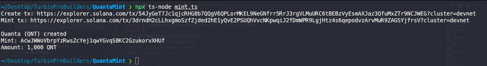

# Quanta (QNT)

**Quanta (QNT)** — a simple SPL token minted on Solana (Devnet).

## Token details

| Field | Value |
|-------|-------|
| **Name** | Quanta |
| **Symbol** | QNT |
| **Mint** | `AcwJWWoVbrpYzRwsZcYej1qwYGvqS8KC2GzukorvXHUf` |
| **Owner** | `GAn8V81NM8Qkmyds8RNDM6GVwruEW31dDoVDpC9CWJz1` |
| **Decimals** | 6 |
| **Initial mint** | 1000 QNT |

## Mint screenshot



## Quick run

```bash
# install
npm install
```
```bash
# run the mint script (from project root)
npx ts-node --esm mint.ts
```